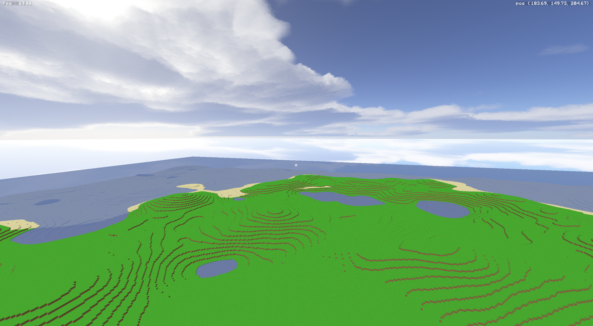
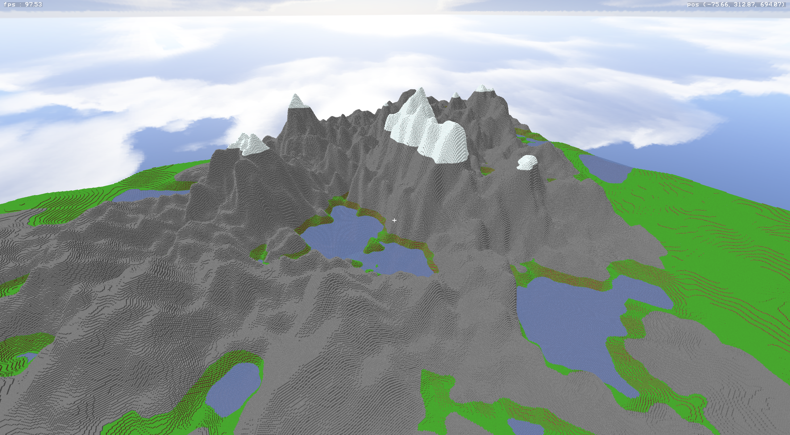
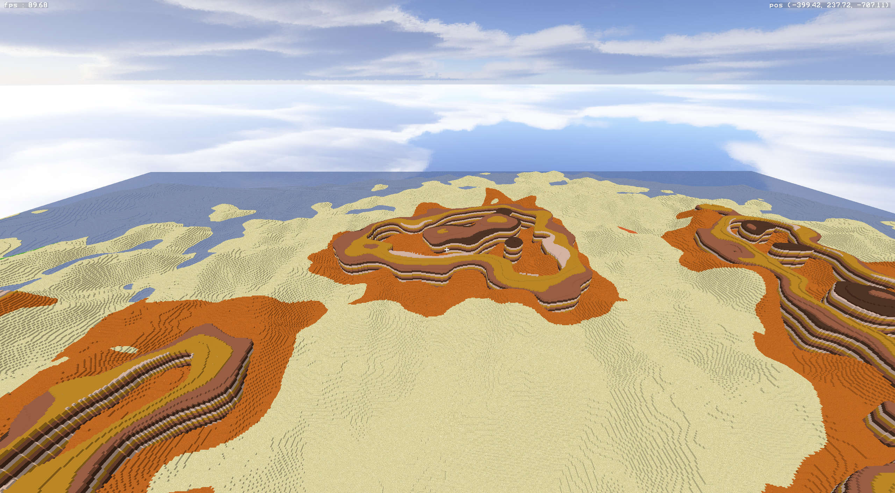
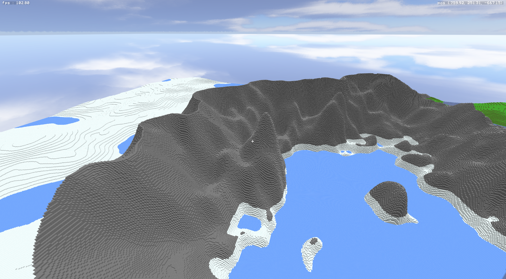
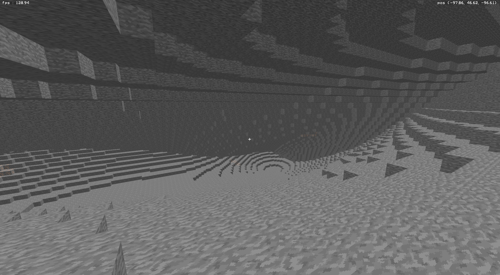

# 🧱 ft_vox — Voxel Engine

<p align="center">
  <strong>Moteur de rendu voxel haute performance avec génération procédurale de terrain</strong><br>
  Projet graphique de l'école 42 | C++ • Vulkan
</p>

---

## 📖 Vue d'ensemble

**ft_vox** est un moteur de rendu voxel optimisé capable d'afficher un monde procédural gigantesque en temps réel. Le projet explore les techniques d'optimisation avancées nécessaires pour rendre des millions de cubes à 60+ FPS.

Le projet repose sur trois piliers fondamentaux :

1. **Génération procédurale** — Création déterministe d'un monde de 16 384 × 256 × 16 384 voxels
2. **Optimisations intensives** — Culling, batching, structure de données cache-friendly pour des performances maximales
3. **Rendu Vulkan** — Pipeline graphique moderne avec calculs GPU pour le meshing et le rendu

---

## 🖼️ Screenshots


*Vue large du terrain procédural avec des plaines et la mer*


*Montagnes et lacs*


*Désert et Messa*


*Toundra, montagne et banquise*


*Système de grottes générées procéduralement*

---

## ✨ Fonctionnalités

### Partie obligatoire

- ✅ **Monde procédural gigantesque** — génération procédurale infinie
- ✅ **Génération procédurale déterministe** — Même seed = même monde (bruit de Perlin/Simplex)
- ✅ **Terrain naturel** — Collines, montagnes, grottes, lacs avec topographie réaliste
- ✅ **Rendu optimisé** — Distance de rendu 160 cubes minimum, 60+ FPS stables
- ✅ **Culling intelligent** — Seules les faces visibles sont rendues (pas de faces cachées)
- ✅ **Système de chunks** — Chargement/déchargement dynamique selon la position
- ✅ **Textures multiples** — Au moins 2 types de blocs (herbe, terre, pierre, sable...)
- ✅ **Skybox** — Ciel sans artefacts de jonction
- ✅ **Caméra libre** — Déplacement WASD + rotation souris
- ✅ **FOV 80°** — Champ de vision large et immersif

### Bonus implémentés

- 🚀 **Distance de rendu étendue** — 256+ cubes avec performances maintenues
- 📊 **Compteur FPS** — Monitoring temps réel des performances
- ⛏️ **Destruction de blocs** — Clic souris pour supprimer des voxels
- 🌍 **Biomes multiples** — Plaines, montagnes, déserts, forêts avec transitions
- 💾 **Gestion mémoire avancée** — RAM/VRAM optimisées
- ⚡ **Pas de freeze** — Génération de chunks asynchrone, 0 latence

---

## 🎮 Utilisation

### Compilation

Prérequis : **C++17**, **Vulkan SDK**, **GLFW**, **Meson**, **Ninja**

```bash
# Cloner le dépôt
git clone https://github.com/agtdbx/ft_vox.git
cd ft_vox

# Installer les dépendances
make install

# Compiler le projet
make

# Lancer le moteur
make run
```

### Contrôles

| Touche/Action   | Fonction                                     |
|-----------------|----------------------------------------------|
| **WASD**        | Déplacement (avant, gauche, arrière, droite) |
| **Souris**      | Rotation de la caméra                        |
| **Espace**      | Monter                                       |
| **Lshift**      | Descendre                                    |
| **Lctrl**       | Sprint (×5 vitesse)                          |
| **Lalt**        | Mode rapide (×20 vitesse)                    |
| **Clic gauche** | Supprimer un bloc                            |
| **Clic droit**  | Poser un bloc                                |
| **F**           | Afficher/Masquer le compteur FPS             |
| **C**           | Afficher la bordure des chuncks              |
| **Tab**         | Mode fil de fer                              |
| **ESC**         | Quitter                                      |

---

## 🧮 Aspects techniques

### Génération procédurale

Le terrain est généré de manière **déterministe** à l'aide de bruit de Perlin 2D :

- **Heightmap** — Génération de la hauteur du terrain (montagnes, vallées)
- **Bruit 2D pour grottes** — Cavités souterraines avec connectivité
- **Biomes** — Zones géographiques distinctes (plaines, montagnes, déserts)
- **Déterminisme** — Même seed → monde identique, génération à la volée par chunk

### Optimisations de rendu

Le projet **recherche la performance** :

- **Greedy Meshing** — Fusion des faces adjacentes identiques en un seul quad
- **Face Culling** — Seules les faces exposées à l'air sont rendues
- **Frustum Culling** — Les chunks hors caméra ne sont pas envoyés au GPU
- **Instancing** — Rendu de milliers de blocs en un seul draw call
- **Async chunk generation** — Génération de terrain dans un thread séparé (0 freeze)
- **Chunk pool** — Réutilisation de la mémoire pour éviter les allocations

### Pipeline Vulkan

Rendu moderne avec Vulkan :

- **Vertex buffers dynamiques** — Mise à jour GPU uniquement quand nécessaire
- **Descriptor sets** — Uniformes et textures optimisées
- **Push constants** — Données rapides (matrices MVP) sans UBO
- **Texture atlas** — Toutes les textures de blocs dans une seule image 2D array
- **Depth pre-pass** — Optimisation early-z pour éviter les overdraw

---

## 📂 Structure du projet

```text
ft_vox/
├── data/               # Textures, polices
├── lib/                # Contiens les libs en .h
├── readme-data/        # Screenshot pour le readme
├── shaders/            # Shaders GLSL
├── srcs/               # Code source C++
├── subprojects/        # Dépendances (GLFW, GLM, etc.)
├── en.subject          # Sujet du projet en anglais
├── Makefile            # Wrapper de build
├── meson.build         # Configuration build Meson
├── README.md           # Ce fichier
└── vsupp               # Ficher de suppression valgrind
```

---

## 🎯 Objectifs pédagogiques (42)

Ce projet de l'école 42 vise à maîtriser :

- ✅ **Optimisation graphique** — Culling, batching, cache coherency
- ✅ **API graphique moderne** — Vulkan (bas niveau, contrôle total GPU)
- ✅ **Algorithmes de génération procédurale** — Bruit, terrains, grottes
- ✅ **Gestion mémoire avancée** — RAM/VRAM, pooling, LRU cache

---

## 🏆 Performances

Configuration de test : **RX 6600 XT / Ryzen 5 5600X**
- **FPS moyen** — 80+ FPS (distance 640 blocs)
- **Mémoire utilisée** — ~927 MB RAM (1,600 chunks, 1,638,400 blocs chargés)

---

## 📦 Dépendances

- **Vulkan SDK 1.3+** (API graphique)
- **GLFW 3.3+** (fenêtrage et input)
- **stb_image** (chargement de textures)
- **gmath** (bibliothèque mathématique custom)

### Installation des dépendances (Linux)

```bash
# Juste les dépendances non prises en charge par meson
make install

# Toutes les dépendances
make full_install
```

---

## 📚 Ressources utiles

- [Vulkan Tutorial](https://vulkan-tutorial.com/)
- [Perlin Noise Algorithm](https://adrianb.io/2014/08/09/perlinnoise.html)
- [Greedy Meshing Algorithm](https://www.youtube.com/watch?v=qnGoGq7DWMc)
- [Frustum Culling Algorithm](https://learnopengl.com/Guest-Articles/2021/Scene/Frustum-Culling)
- [Créer le terrain à partir du Perlin Noise](https://www.redblobgames.com/maps/terrain-from-noise/)

---

## 📜 License

Projet pédagogique école 42 — Usage éducatif uniquement.

---

## 👥 Auteurs

**Projet collaboratif à 2 personnes**

**Auguste Deroubaix** (agtdbx) 🔗 [GitHub](https://github.com/agtdbx) • 🎓 Étudiant 42</br>
**Hugo De Min** (Bonchour) 🔗 [GitHub](https://github.com/Bonchour) • 🎓 Étudiant 42
